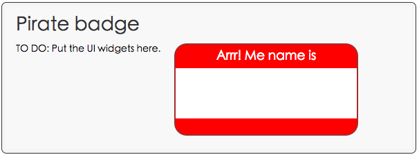

#步骤一：运行一个框架应用

在这一步中，你打开源文件，熟悉你自己的 Dart 和 HTML 代码，然后运行这个 App。

---

####新建一个 1-blankbadge 目录

在Dart编辑器中，点击 ``1-blankbadge`` 下 ``web`` 目录左边的小箭头，展开 ``web`` 目录。这个目录包含一个 ``piratebadge.css`` 文件，一个 ``piratebadge.dart`` ，和一个 ``piratebadge.html`` 文件。

---

####打开文件

在Dart编辑器中，通过双击文件名来打开 ``piratebadge.dart`` 文件和 ``piratebadge.html`` 文件

---

####查看代码

熟悉一下这个框架应用的 HTML 和 Dart 代码。

``piratebadge.html``

````
<html>
  <head>
    <meta charset="utf-8">
    <title>Pirate badge</title>
    <meta name="viewport"
          content="width=device-width, initial-scale=1.0">
    <link rel="stylesheet" href="piratebadge.css">
  </head>
  <body>
    <h1>Pirate badge</h1>
    
    <div class="widgets">
      TO DO: Put the UI widgets here.
    </div>
    <div class="badge">
      <div class="greeting">
        Arrr! Me name is
      </div>
      <div class="name">
        <span id="badgeName"> </span>
      </div>
    </div>

    <script type="application/dart" src="piratebadge.dart"></script>
    <script src="packages/browser/dart.js"></script>
  </body>
</html>
````

关键信息：

- 在这次代码试验中，你对  ``piratebadge.html`` 文件的所有更改都是在 ``class`` 为 ``widgets`` 的 ``<div>`` 标签中进行的。

- 在后续步骤中, ``id`` 为 ``badgeName`` 的 ``<span>`` 标签会被具有用户输入功能的Dart代码升级。

- 第一个 ``<script>`` 标签引入了一个主文件，``piratebadge.dart`` 文件。

- Dart 虚拟机可以原生地运行 Dart 代码。 Dart 虚拟机会在 Dartium 中构建－－一个特殊的，可以让你运行Dart App的 Chromium 浏览器。

- ``packages/browser/dart.js`` 脚本会检查原生Dart支持，同时引导Dart虚拟机载入编译JavaScript脚本。


---


``piratebadge.dart``

````
void main() {
  // 你的应用从这里开始
}

````

关键信息：

- 这个文件包含一个程序的入口 main() 方法. 在 ``piratebadge.html`` 文件的  ``<script>`` 标签会通过运行这个方法来开始应用。

- main() 方法是一个 ``top-level`` 的方法。

- 一个 ``top-level`` 的变量或者方法是在类外进行公开定义的


---

####运行这个应用

在Dart编辑器中运行一个应用：右击 ``piratebadge.html`` 文件然后选择 ``Run in Dartium``。

 

Dart 编辑器启动了 Dartium，在构建之后，读取到了 ``piratebadge.html`` 文件。  ``piratebadge.html`` 文件启动了这个应用并且调用了main()方法。

你应该看到如下结果。

 

