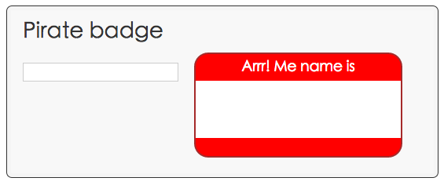

#步骤二：添加一个输入框

在这一步中，你将在你的 App 中添加一个输入框。作为一个用户文本输入框，Dart可以从中取得一个值。

---

####编辑 piratebadge.html

在 class 为 widgets 的 ``<div>`` 中添加一个 ``<input>`` 标签。

````
...
<div class="widgets">
  <div>
    <input type="text" id="inputName" maxlength="15">
  </div>
</div>
...

````

- ``<input>`` 标签的 id 是 ``inputName``。Dart 使用 ``#inputName`` 的 CSS 选择器从 DOM 中选择这个元素

---

####编辑 piratebadge.dart

在文件的顶部引入 ``dart:html`` 库。

````
import 'dart:html';
````

- 这里从 ``dart:html`` 引入了所有的类和其他资源。

- 不要担心臃肿的代码。构建程序会帮你进一步简化代码。

- ``dart:html`` 库包含了所有DOM元素类型。

- 一会儿你将会使用一些关键字来导入一些特殊的库。

- Dart 编辑器会提示你导入的库是未被使用的，没关系，下一步我们就会修复它。

---


添加一个方法来监听输入框

````
void main() {
  querySelector('#inputName').onInput.listen(updateBadge);
}
````

- 在 ``dart:html`` 中定义的 ``querySelector()`` 方法，获取到了指定的 DOM。这里，通过#inputName选择器获取到了指定的输入框。

- ``querySelector()`` 方法的返回值是一个 DOM 元素。

- 鼠标和键盘事件被存放在一个流中。

- 提供一个异步的流数据序列。使用 ``listen()`` 方法，可以从流中得到安全的数据。

- ``onInput.listen()`` 监听到了输入框的流事件。当监听到时，``updateBadge()`` 方法被调用。

- 当用户按下一个键时，将产生一个事件。

- 你可以用单引号或双引号来创建一个字符串。

- Dart 编辑器提示你有个方法没有被创建，让我们来解决它。

---


用一个 ``top-level`` 级别的方法来实现一个事件方法。

````
...
void updateBadge(Event e) { 
  querySelector('#badgeName').text = e.target.value;
}

````

- 这个函数将 ``badgename`` 元素的值设置成文本输入字段的值。

- 事件 ``e`` 是 ``updateBadge`` 函数的参数. 这个参数的名字是 ``e``；类型是一个 ``Event``

---

修复警告信息

````
...
void updateBadge(Event e) { 
  querySelector('#badgeName').text = (e.target as InputElement).value;
}
````
- 在这个例子中，``e.target`` 是产生事件的输入源。


---

####运行应用

保存你的文件

右击 ``piratebadge.html`` 选择 ``Run in Dartium``。

和下面的示例比较一下。
 

 


