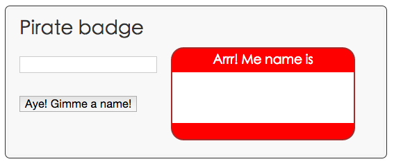

#步骤3:添加一个按钮

在这一步中，你将添加一个按钮。应用启用时，文本字段中没有文本。用户单击按钮时，应用将显示出 Anne Bonney 的字样。

---

####编辑 ``piratebadge.html``

````
...
<div class="widgets">
  <div>
    <input type="text" id="inputName" maxlength="15">
  </div>
  <div>
    <button id="generateButton">Aye! Gimme a name!</button>
  </div>
</div>
...

````

- 按钮有一个 ID 叫做 ``generateButton`` ，所以Dart可以找到它。

---

####编辑 piratebadge.dart

````
import 'dart:html';

ButtonElement genButton;
````

- 按钮元素是 ``dart:html`` 中众多元素的一个。
- 变量，包括数字，如果没有实质内容，就为null。

---


````
void main() {
  querySelector('#inputName').onInput.listen(updateBadge);
  genButton = querySelector('#generateButton');
  genButton.onClick.listen(generateBadge);
}

````

- 注册一个 ``click`` 事件

---


````
...
void setBadgeName(String newName) {
  querySelector('#badgeName').text = newName;
} 

````
- 这个方法更新了 HTML 页面

---

为按钮实现一个点击监听

````
...

void generateBadge(Event e) {
  setBadgeName('Anne Bonney');
}
````
- 这个方法将 ``badgeName`` 的显示内容设置为了 Anne Bonney 。

---
修改 ``updateBadge()`` 方法，在其中调用 ``setBadgeName()`` 方法

````
void updateBadge(Event e) {
  String inputName = (e.target as InputElement).value;
  setBadgeName(inputName);
}
````
- 将文本框输入的值赋值给一个本地 String 变量

---

在 ``updateBadge()`` 方法中添加一个 if-else 结构

````
void updateBadge(Event e) {
  String inputName = (e.target as InputElement).value;
  setBadgeName(inputName);
  if (inputName.trim().isEmpty) {
    // To do: add some code here.
  } else {
    // To do: add some code here.
  }
}

````

- ``String`` 来源于 ``dart:core`` 库，这个库在每一个 Dart程序中都被自动添加。

- Dart 拥有公共的语言结构，例如 ``if-else``。


---


````
void updateBadge(Event e) {
  String inputName = (e.target as InputElement).value;
  setBadgeName(inputName);
  if (inputName.trim().isEmpty) {
    genButton..disabled = false
             ..text = 'Aye! Gimme a name!';
  } else {
    genButton..disabled = true
             ..text = 'Arrr! Write yer name!';
  }
}

````

- ``updateBadge()`` 的代码在按钮元素上使用 cascade 操作。其结果和下面代码结果一样

````
genButton.disabled = false;
genButton.text = 'Aye! Gimme a name!';
````

---

####运行应用

保存你的文件

右击 ``piratebadge.html`` 选择 ``Run in Dartium``。

和下面的实际比较一下。
 

 