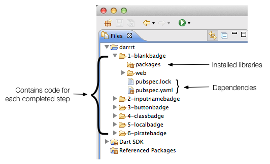

# 步骤 0：环境搭建

在这一步里，你需要下载 Dart 和示例代码。

## 获取 Dart

如果你还没获取 Dart，去下载下来并解压缩 zip 文件， 然后会得到一个名为 *dart* 的文件夹。（更多信息请访问[下载页](https://www.dartlang.org/downloads/))

> 提示：Dart编辑器需要Java 6或更高版本支持。**有疑问？**请查看 [Dart 编辑器问题处理](https://www.dartlang.org/tools/editor/troubleshoot.html)页面。

## 运行编辑器

打开 *dart* 文件夹并双击 *Dart-Editor*。

**有疑问？**请查看 [Dart 编辑器问题处理](https://www.dartlang.org/tools/editor/troubleshoot.html)页面。

## 获取示例代码

用以下方式从 [one-hour-codelab GitHub repo](https://github.com/dart-lang/one-hour-codelab) 获取示例代码：

* 下载 zip 文件，[one-hour-codelab-master.zip](https://github.com/dart-lang/one-hour-codelab/archive/master.zip)。解压缩 ZIP 文件，得到一个名为 *one-hour-codelab-master* 的文件夹。

* Clone 版本库。 例如，在命令行输入以下命令：

		% git clone https://github.com/dart-lang/one-hour-codelab.git
	这将会创建一个名为 *one-hour-codelab* 的文件夹。

## 打开 one-hour-codelab 示例

在 Dart 编辑器中，使用 **File > Open Existing Folder...** 来打开 *one-hour-codelab* 下面的 *darrrt* 文件夹。

> 提示：如果你在文件名左边看到红色的叉叉或者 *packages* 目录丢失，说明软件包没有安装好。右击 *pubspec.yaml* 并选择 **Pub Gut**。

### 关键信息

* 几个带序号的目录包含了每一步骤的完整代码。*1-blankbadge* 包含了最基本的框架版App，你可以从这开始学习。*6-piratebadge* 包含了最终版本的 App。
* 每一个带序号的目录都包含了一个完整的项目，他们包括：
	* 一个 *packages* 目录，包含类库和 App 运行时依赖的其它文件
	* *pubspec.yaml* 和 *pubspec.lock* 文件，指定了包的依赖。这个项目已经为你设置好了所有的依赖。Dart编辑器会自动安装所需的包。
	* **Dart SDK** 包含了由Dart软件开发包提供的所有方法、变量和类的源代码。
	* **Referenced Packages** 包含了应用所依赖的附加类库的所有方法、变量和类的源代码。
		
